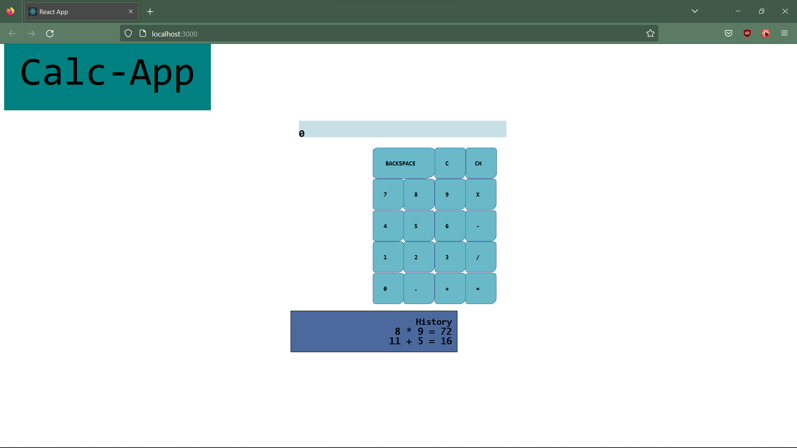

# Calc-App

- A simple calculator web-app, made with react. A practice project to learn react.
- Implemented shunting yard algorithm to process tokens for calculation.
- Possible future improvements: dark mode, more calculator functionality (ex. square root, exponentials, etc)

# Install and Run
## Requirements
- nodejs
- npm
## Steps to run
- clone repo
- install dependencies
- npm run start (note: this is will run in development mode)

## Screenshot:
